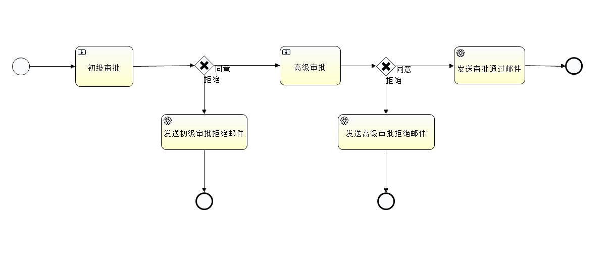

# 流程审批服务端

## 一、模块功能

基于Flowable6.4和SpringBoot2实现的流程审批服务模块，具有如下接口功能：

- 开启一个审批流程

- 节点任务审批与意见

- 流程进展状态查询

- 用户待办任务查询

- 查询用户的历史流程

## 二、程序结构

```
└── com
    └── gitee
        └── approval
            ├── ApprovalWorkflowApplication.java      //程序启动类
            ├── aspect  //截面包
            │   ├── WebLogAspect.java                 //接口请求日志类
            ├── config  //配置包
            │   ├── DefaultClockConfig.java           //Flowable的时钟配置类
            │   ├── FlowableBeanConfig.java           //Flowable的Bean配置类
            │   ├── SwaggerConfig.java                //Swagger的配置类
            │   └── ValidatorConfig.java              //Validator检查配置类
            ├── constant //常量包
            │   └── ConstantValues.java               //常量值定义类
            ├── controller //控制器包
            │   ├── ApprovalController.java           //审批接口控制器类
            │   └── ExceptionController.java          //全局异常控制器类
            ├── delegate  //节点任务包
            │   ├── SendJuniorRejectionMailDelegate.java  //模拟的初级审批拒绝邮件发送
            │   ├── SendSeniorRejectionMailDelegate.java  //模拟的高级审批拒绝邮件发送
            │   └── SendApprovalSuccessEmailDelegate.java //模拟审批通过邮件发送
            ├── pojo      //POJO类
            │   ├── HistoryProcessDTO.java
            │   ├── ProcessInstanceDTO.java
            │   ├── ProcessStatusDTO.java
            │   ├── ResponseResult.java
            │   └── TaskInstanceDTO.java
            └── service   //服务包
                ├── impl  //实现包
                │   └── FlowableProcessServiceImpl.java  //Flowable的流程审批实现类
                └── IProcessService.java                 //流程审批接口定义类
```

## 三、审批流程图



BPMN流程定义文件src/main/resources/processes/request-approval-resource.bpmn：

```
<?xml version="1.0" encoding="UTF-8"?>
<definitions xmlns="http://www.omg.org/spec/BPMN/20100524/MODEL" xmlns:xsi="http://www.w3.org/2001/XMLSchema-instance" xmlns:xsd="http://www.w3.org/2001/XMLSchema" xmlns:activiti="http://activiti.org/bpmn" xmlns:bpmndi="http://www.omg.org/spec/BPMN/20100524/DI" xmlns:omgdc="http://www.omg.org/spec/DD/20100524/DC" xmlns:omgdi="http://www.omg.org/spec/DD/20100524/DI" typeLanguage="http://www.w3.org/2001/XMLSchema" expressionLanguage="http://www.w3.org/1999/XPath" targetNamespace="http://www.activiti.org/test">
  <process id="requestResourceApprovalProcess" name="Request Resource Approval " isExecutable="true">
    <startEvent id="starter" name="Starter"></startEvent>
    <serviceTask id="sendJuniorRejectEmail" name="发送初级审批拒绝邮件" activiti:class="SendJuniorRejectionMailDelegate"></serviceTask>
    <endEvent id="juniorRejectEnd" name="Junior Reject End"></endEvent>
    <sequenceFlow id="flow5" sourceRef="sendJuniorRejectEmail" targetRef="juniorRejectEnd"></sequenceFlow>
    <userTask id="seniorApproval" name="高级审批" activiti:assignee="${seniorAdmin}"></userTask>
    <userTask id="juniorApproval" name="初级审批" activiti:assignee="${juniorAdmin}"></userTask>
    <exclusiveGateway id="exclusivegateway1" name="Exclusive Gateway1"></exclusiveGateway>
    <sequenceFlow id="juniorSuccessFlow" name="同意" sourceRef="exclusivegateway1" targetRef="seniorApproval">
      <conditionExpression xsi:type="tFormalExpression"><![CDATA[${approved=='Y'}]]></conditionExpression>
    </sequenceFlow>
    <sequenceFlow id="juniorRejectFlow" name="拒绝" sourceRef="exclusivegateway1" targetRef="sendJuniorRejectEmail">
      <conditionExpression xsi:type="tFormalExpression"><![CDATA[${approved=='N'}]]></conditionExpression>
    </sequenceFlow>
    <exclusiveGateway id="exclusivegateway2" name="Exclusive Gateway2"></exclusiveGateway>
    <sequenceFlow id="flow7" sourceRef="seniorApproval" targetRef="exclusivegateway2"></sequenceFlow>
    <endEvent id="approvalSuccessEnd" name="Approval Success End"></endEvent>
    <sequenceFlow id="seniorSuccessFlow" name="同意" sourceRef="exclusivegateway2" targetRef="sendApprovalSuccessEmail">
      <conditionExpression xsi:type="tFormalExpression"><![CDATA[${approved=='Y'}]]></conditionExpression>
    </sequenceFlow>
    <serviceTask id="sendSeniorRejectEmail" name="发送高级审批拒绝邮件" activiti:class="SendSeniorRejectionMailDelegate"></serviceTask>
    <endEvent id="seniorRejectEnd" name="Senior Reject End"></endEvent>
    <sequenceFlow id="seniorRejectFlow" name="拒绝" sourceRef="exclusivegateway2" targetRef="sendSeniorRejectEmail">
      <conditionExpression xsi:type="tFormalExpression"><![CDATA[${approved=='N'}]]></conditionExpression>
    </sequenceFlow>
    <sequenceFlow id="flow9" sourceRef="sendSeniorRejectEmail" targetRef="seniorRejectEnd"></sequenceFlow>
    <sequenceFlow id="flow11" sourceRef="juniorApproval" targetRef="exclusivegateway1"></sequenceFlow>
    <sequenceFlow id="flow12" sourceRef="starter" targetRef="juniorApproval"></sequenceFlow>
    <serviceTask id="sendApprovalSuccessEmail" name="发送审批通过邮件" activiti:class="SendApprovalSuccessEmailDelegate"></serviceTask>
    <sequenceFlow id="flow13" sourceRef="sendApprovalSuccessEmail" targetRef="approvalSuccessEnd"></sequenceFlow>
  </process>
</definitions>
```

## 四、打包与部署

### 1、程序打包

```
git clone https://gitee.com/inrgihc/ApprovalWorkflow.git
cd ApprovalWorkflow/
sh build.sh
```

### 2、程序部署

- 使用项目中的flowable-6.4.1-mysql.sql文件初始化一个mysql数据库

- 将上述程序打包的target目录下的xxx.tar.gz文件拷贝到部署目录下并解压即可

### 3、文件配置

配置文件路径：conf/application.properties

```
# server port settings
server.port=9080

# application name settings
spring.application.name=ApprovalServer

# mysql database settings
spring.datasource.url=jdbc:mysql://172.17.2.10:3306/tang?characterEncoding=utf8&useSSL=false
spring.datasource.username=tangyibo
spring.datasource.password=tangyibo
spring.datasource.driver-class-name=com.mysql.jdbc.Driver

# flowable engine configure settings
flowable.db-history-used=true
flowable.history-level=full
flowable.check-process-definitions=true
flowable.async-executor-activate=false
flowable.database-schema-update=true
```

### 4、启动与停止

- 启动

```
bin/startup.sh
```

- 停止

```
bin/shutdown.sh
```

## 四、接口设计


### 1、在线接口

在线接口地址：

http://127.0.0.1:9080/swagger-ui.html

### 2、测试流程

- (1) 启动一个二级审批流程

**申请者test发送使用资源aaaaaa的审批请求,设置初审者为用户tang,终审者为用户admin**

请求：

```
curl -X POST -d 'juniorAdmin=tang&requestUser=test&resourceId=aaaaaa&seniorAdmin=admin' "http://127.0.0.1:9080/process/begin" -H "accept: application/json"
```

响应：

```
{
  "errcode": 0,
  "errmsg": "success",
  "data": {
    "processInstanceId": "7d3903b2-4e2b-11ea-8256-00d0f8000001",
    "processDeploymentId": "aebafc8a-4e0e-11ea-af4d-00d0f8000001"
  }
}
```

- (2) 查看上述流程进度

**申请者test根据processInstanceId查看流程审批进度，结果为：流程已进入初级审批阶段，尚未审批通过**

请求：

```
curl -X GET "http://127.0.0.1:9080/process/status?processInstanceId=7d3903b2-4e2b-11ea-8256-00d0f8000001" -H "accept: application/json"
```

响应：

```
{
  "errcode": 0,
  "errmsg": "success",
  "data": {
    "param": {
      "resourceId": "aaaaaa",
      "approved": "N",
      "juniorAdmin": "tang",
      "requestUser": "test",
      "seniorAdmin": "admin"
    },
    "status": [
      {
        "taskName": "初级审批",
        "assignee": "tang",
        "createTime": "2020-02-13T06:38:47.975+0000",
        "approved": null,
        "comment": null
      }
    ]
  }
}
```

- (3) 用户tang查看待办任务

**由于test用户的申请，用户tang下存在一个待办任务需要处理**

请求：

```
curl -X GET "http://127.0.0.1:9080/process/tasks?assignee=tang" -H "accept: application/json"
```

响应：

```
{
  "errcode": 0,
  "errmsg": "success",
  "data": [
    {
      "taskId": "7d3b9bcf-4e2b-11ea-8256-00d0f8000001",
      "taskName": "初级审批",
      "processInstanceId": "7d3903b2-4e2b-11ea-8256-00d0f8000001",
      "requestUser": "test",
      "resourceId": "aaaaaa",
      "createTime": "2020-02-13T06:38:47.975+0000"
    }
  ]
}
```

- (4) 用户tang处理待办任务（ID为7d3b9bcf-4e2b-11ea-8256-00d0f8000001）

**用户tang的审批结果为通过，审批意见为：ok**

请求：

```
curl -X POST -d 'approved=true&comment=ok&taskId=7d3b9bcf-4e2b-11ea-8256-00d0f8000001' "http://127.0.0.1:9080/process/complete" -H "accept: application/json"
```

响应：

```
{
  "errcode": 0,
  "errmsg": "success",
  "data": "ok"
}
```

- (5) 继续查看该流程进度

**申请者test根据processInstanceId查看流程审批进度，结果为：流程已完成初审，并通过，已经进入高级审批阶段，尚未审批**

请求：

```
curl -X GET "http://127.0.0.1:9080/process/status?processInstanceId=7d3903b2-4e2b-11ea-8256-00d0f8000001" -H "accept: application/json"
```

响应：

```
{
  "errcode": 0,
  "errmsg": "success",
  "data": {
    "param": {
      "resourceId": "aaaaaa",
      "approved": "N",
      "juniorAdmin": "tang",
      "requestUser": "test",
      "seniorAdmin": "admin"
    },
    "status": [
      {
        "taskName": "初级审批",
        "assignee": "tang",
        "createTime": "2020-02-13T06:38:47.975+0000",
        "approved": "Y",
        "comment": "ok"
      },
      {
        "taskName": "高级审批",
        "assignee": "admin",
        "createTime": "2020-02-13T06:46:46.660+0000",
        "approved": null,
        "comment": null
      }
    ]
  }
}
```

- (6) 用户admin查看待办任务

**由于test用户的申请，用户tang已经完成审批，需要admin的审批结果，此时用户admin会存在一个待办任务需要处理**

请求：

```
curl -X GET "http://127.0.0.1:9080/process/tasks?assignee=admin" -H "accept: application/json"
```

响应：

```
{
  "errcode": 0,
  "errmsg": "success",
  "data": [
    {
      "taskId": "9a8bc519-4e2c-11ea-8256-00d0f8000001",
      "taskName": "高级审批",
      "processInstanceId": "7d3903b2-4e2b-11ea-8256-00d0f8000001",
      "requestUser": "test",
      "resourceId": "aaaaaa",
      "createTime": "2020-02-13T06:46:46.660+0000"
    }
  ]
}
```

- (7) 用户admin处理待办任务（ID为9a8bc519-4e2c-11ea-8256-00d0f8000001）

**用户admin的审批结果为通过，审批意见为：haode**

请求：

```
ccurl -X POST -d 'approved=true&comment=haode&taskId=9a8bc519-4e2c-11ea-8256-00d0f8000001' "http://127.0.0.1:9080/process/complete" -H "accept: application/json"
```

响应：

```
{
  "errcode": 0,
  "errmsg": "success",
  "data": "ok"
}
```

- (8) 再次查看该流程进度

**申请者test根据processInstanceId再次查看流程审批进度，结果为：流程已完成终审，并通过，流程已经结果，整个流程的审批结果为：Y (通过)**

请求：

```
curl -X GET "http://127.0.0.1:9080/process/status?processInstanceId=7d3903b2-4e2b-11ea-8256-00d0f8000001" -H "accept: application/json"
```

响应：

```
{
  "errcode": 0,
  "errmsg": "success",
  "data": {
    "param": {
      "resourceId": "aaaaaa",
      "approved": "Y",
      "juniorAdmin": "tang",
      "requestUser": "test",
      "seniorAdmin": "admin"
    },
    "status": [
      {
        "taskName": "初级审批",
        "assignee": "tang",
        "createTime": "2020-02-13T06:38:47.975+0000",
        "approved": "Y",
        "comment": "ok"
      },
      {
        "taskName": "高级审批",
        "assignee": "admin",
        "createTime": "2020-02-13T06:46:46.660+0000",
        "approved": "Y",
        "comment": "haode"
      }
    ]
  }
}
```


- (9) 最后用户tang查询自己处理过的流程

**审批者tang查询自己曾经处理的流程，结果为存在一个流程信息（含有流程的实例ID）**

请求：

```
curl -X GET "http://127.0.0.1:9080/process/history?assignee=tang" -H "accept: application/json"
```

响应：

```
{
  "errcode": 0,
  "errmsg": "success",
  "data": [
    {
      "instanceId": "7d3903b2-4e2b-11ea-8256-00d0f8000001",
      "taskId": "7d3b9bcf-4e2b-11ea-8256-00d0f8000001",
      "startTime": "2020-02-13T06:38:47.975+0000",
      "endTime": "2020-02-13T06:46:46.623+0000"
    }
  ]
}
```